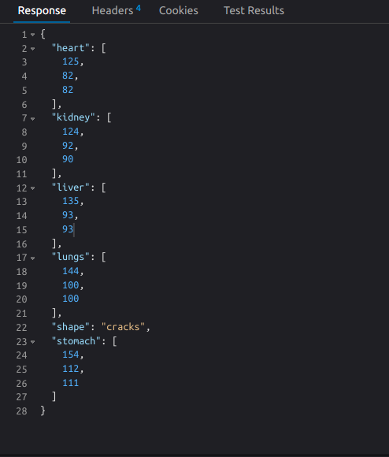

# server
the server has three endpoints:
- **"/quality"** this is POST method recieves image return json response {"quality":"good"} with 200 status code for good resolution image and {"quality":"poor", "error":"The image has bad quality"} with 400 status code
- **"/heartrate"** this is POST method recieves video as content_type:'multipart/form-data' return json format {"value": Integer number} with status code 200  
- **"/tongue"** this is POST method recieves image of user tongue return json response as shown

